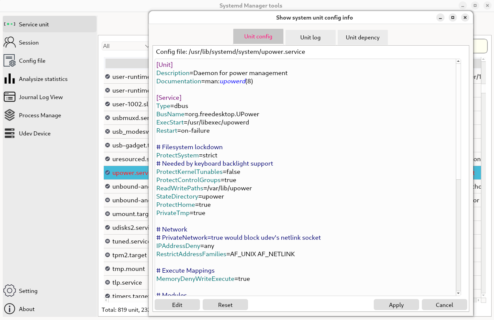
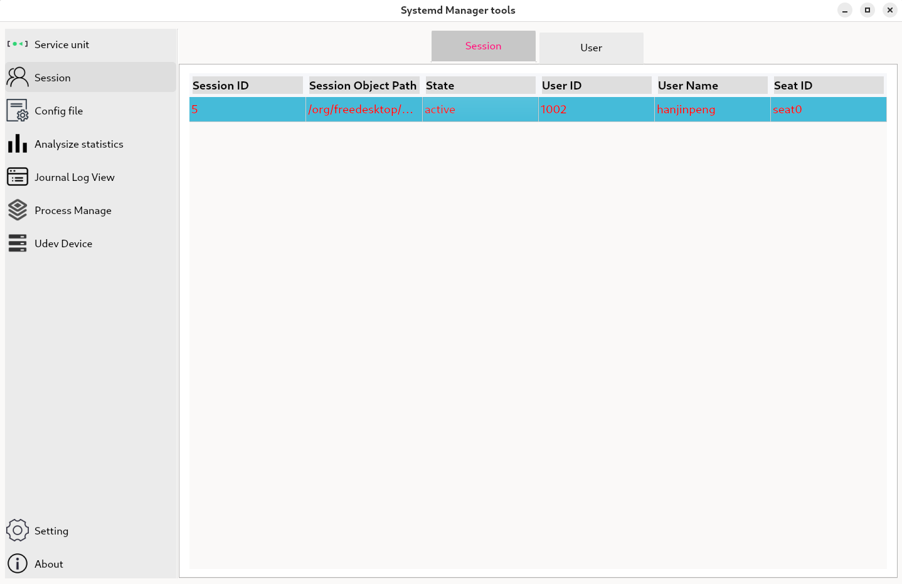
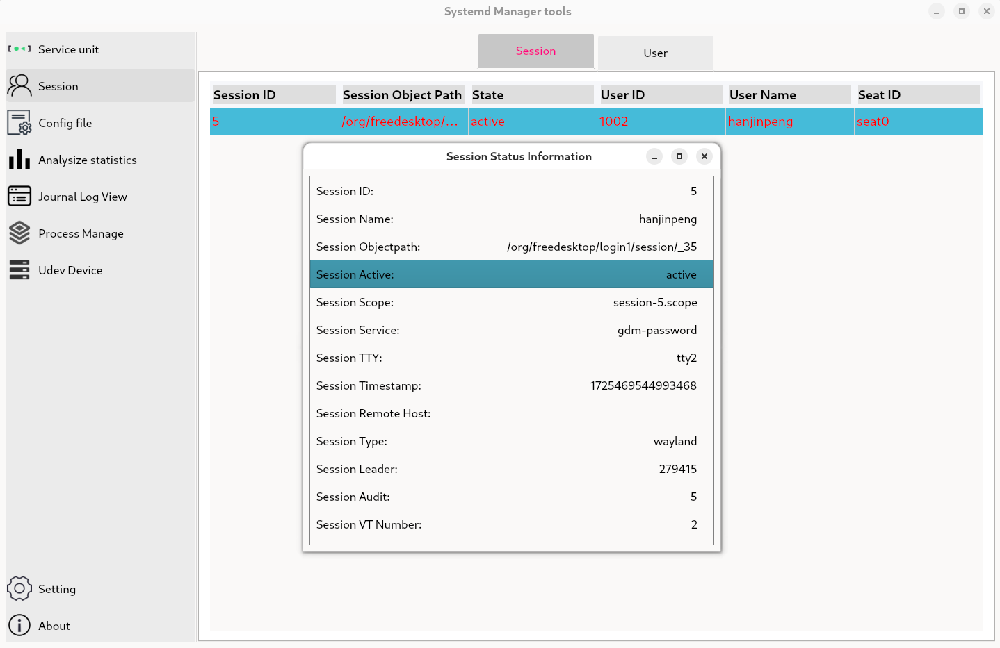
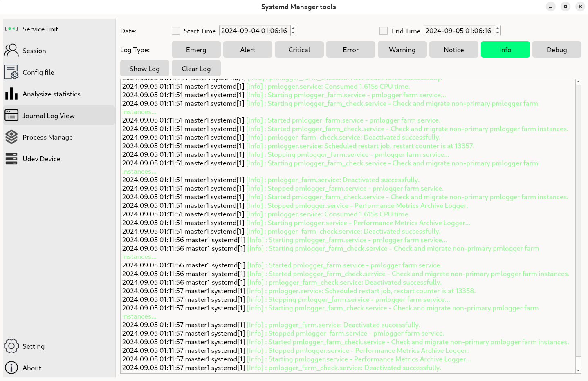
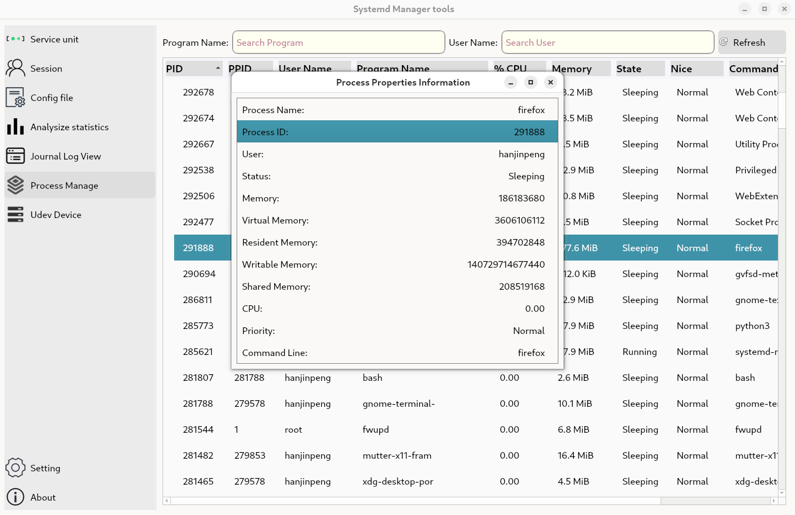

[](https://github.com/prownd/systemd-manage/actions/workflows/main.yml)

# Systemd manage tool
systemd-manage is a graphical systemd service management tool, developed using the Qt graphics library.  
It can be providing functions such as service management, user sessions, configuration file modification, log queries, performance analysis and process management, etc.  
Graphic interface operation, simple and convenient service management.

# Build Deploy and Install
Use qmake for compile build, configuration, and installation

```bash
1. qmake
2. make
3. make install
```

In addition, it can also be compiled into distribution software packages, such as rpm package format
```bash
cd dist
./build.sh
```

# Instructions for using systemd management
### System Service Management:
Manage system units and user units, filter unit types, etc


### System Service Details:
Display service unit content, logs, dependencies, etc


### User session management:
Management system login sessions and users


### User session details:
Display session status information, such as ID, name, path, status, TTY, etc


### Configuration file:
View and manage the configuration files of systemd, modify parameter values


### Journal log:
View system logs, select time period and log level


### System performance analysis:
Display the time consumption during the system startup phase, as well as a more detailed flame diagram to view the specific startup time of each service


### Process management:
Display the currently running process, filter process names, and users


### Process Details Information:
Display process detail information, eg: name, id, state, memory, etc


### Preferred settings:
Setting system preferences, setting display language


### Application version information:
Display information about program version, license, etc


# license agreement
systemd-manage is free software: you can redistribute it and/or modify it under the terms of the GNU General Public License as published by the Free Software Foundation, either version 3 of the License, or (at your option) any later version.

systemd-manage is distributed in the hope that it will be useful, but WITHOUT ANY WARRANTY; without even the implied warranty of MERCHANTABILITY or FITNESS FOR A PARTICULAR PURPOSE. See the GNU General Public License at [ http://www.gnu.org/licenses/ ]( http://www.gnu.org/licenses/ ) for more details.

# Feedback and Contact
If you encounter bug issues or have better suggestions while using it.  
Please report issue questions or submit PR for modification and optimization.  
You can also send me an email to contact and communicate with me  
Welcome feedback and contributions, thank you!

Contact email:  [hanjinpeng127@gmail.com](mailto:hanjinpeng127@gmail.com)
