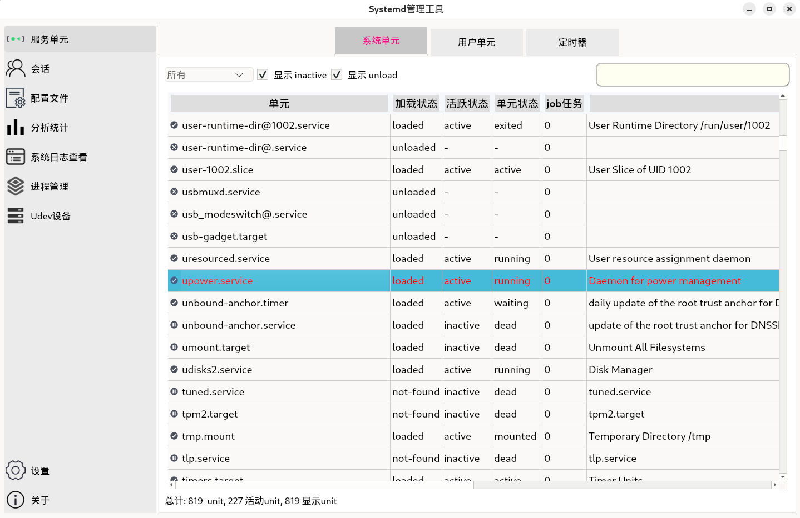
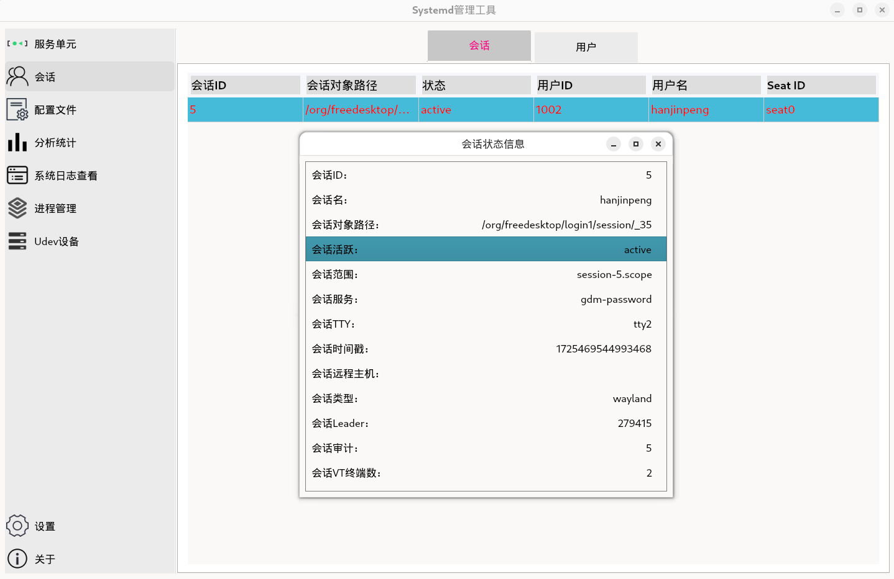
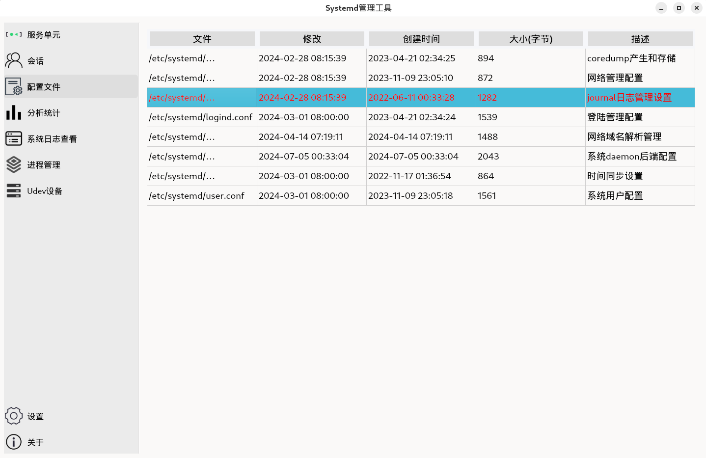
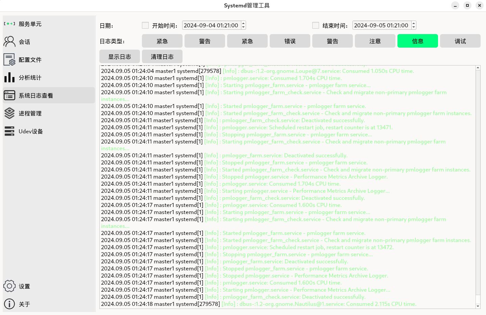
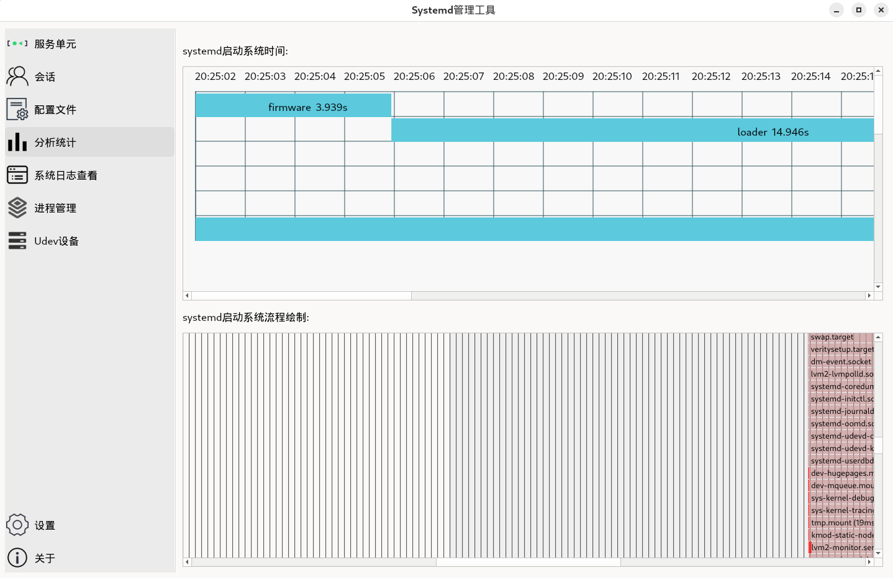
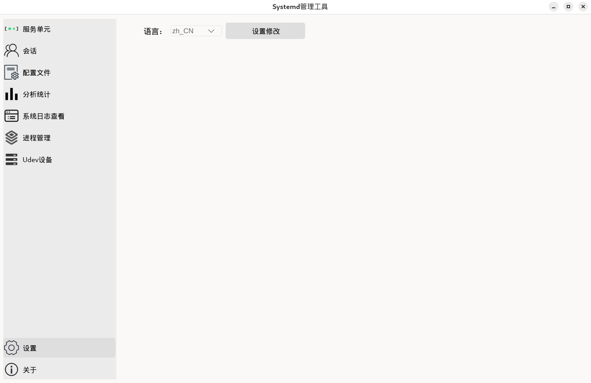

# systemd-manage工具
---
systemd-manage是一个基于systemd服务管理的图形化工具，使用qt图形库进行开发，提供服务管理，用户会话，配置文件修改，日志查询，性能分析，进程管理等功能。图形化，简单方便的进行系统服务的管理。

# 部署安装
---
使用qmake进行编译和部署
```bash
1. qmake
2. make
3. make install
```


# systemd-manage使用
---
##### 系统服务管理:
可以进行系统单元和用户单元的管理，筛选unit类型等


##### 系统服务详情:
显示服务单元内容，日志，依赖关系等


##### 用户会话管理：
管理系统登陆的会话和用户


##### 用户会话详情：
显示会话的状态信息，比如：ID，名字，路径，状态，TTY等信息


##### 配置文件：
对systemd的配置文件进行查看管理，修改参数项值


##### journal日志：
查看系统的日志，可以选择时间段，日志级别


##### systemd性能分析：
显示系统启动阶段时间消耗，还有更详细的火焰图，查看具体的每个服务的启动时间


##### 进程管理：
显示当前运行的进程，可以过滤筛选进程名，用户


##### 首选项设置：
系统首选项的设置，设置显示语言


##### 关于程序和版本：
显示关于程序版本，许可信息等


# 许可协议
---
systemd-manage is free software: you can redistribute it and/or modify it under the terms of the GNU General Public License as published by the Free Software Foundation, either version 3 of the License, or (at your option) any later version.

systemd-manage is distributed in the hope that it will be useful, but WITHOUT ANY WARRANTY; without even the implied warranty of MERCHANTABILITY or FITNESS FOR A PARTICULAR PURPOSE. See the GNU General Public License at [http://www.gnu.org/licenses/](http://www.gnu.org/licenses/) for more details.


# 反馈和联系
---
如果你在使用中，发现bug问题，或者有更好的建议意见。
还请提出issue问题，或者提交pr来进行修改优化。
也可以发送邮件与我联系交流。
欢迎反馈贡献，谢谢!

联系邮箱：  hanjinpeng127@gmail.com


